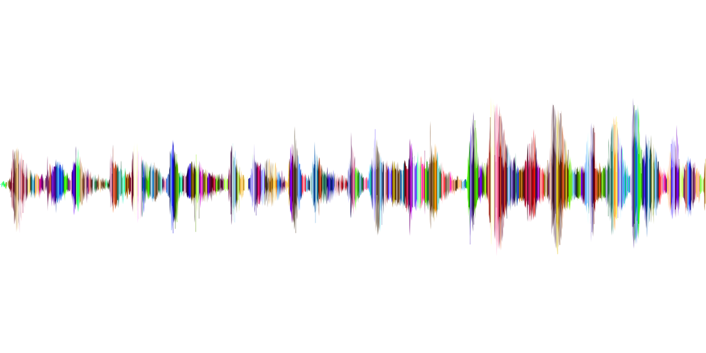

<h1>TRIGGER WORD DETECTION</h1>

Ứng dụng Deeplearning trong xử lý âm thanh ứng dụng trong các thiết bị hỗ trợ giọng nói như Alexa,Siri,Google Home

<h1>Mục tiêu bài toán :</h1>

Phát hiện từ khóa activate trog 1 audio bất kì

<h1>Xử lí dữ liệu :</h1>

Chuỗi Fourier

<h1>Mô hình sử dụng :</h1>

Áp dụng mô hình RNN áp dụng các lớp nâng cao như GRU hoặc LSTM

<h1>Hướng dẫn chạy chương trình:</h1>

Chạy chương trình chính bằng main.ipnb

<h1>Dữ liệu :</h1>
<ul>
	<li>Tập train nằm trong mục XY_train gồm 25 audio 10 giây gồm các từ khóa activate và các từ nhiễu </li>
	<li>Tập test nằm trong mục XY_dev gồm 25 audio 10 giây</li>
	<li>Ví dụ dữ liệu :vinh2.wav</li>
</ul>
<h1>Output :</h1>
<ul>
	<li>Audio sau khi đã được đánh dấu bằng tiếng beep sau từ khóa</li>
	<li>testchime_output.wav</li>
</ul>
<h1>Đánh giá độ chính xác :</h1>

Model cho kết quả khá tốt với tập train độ chính xác là 97% tập test là 92%

<h1>Ứng dụng thực tiễn muốn phát triển :</h1>
<ul>
	<li>Phát hiện các từ ngữ phản cảm và chèn kí tự nhiễu trong audio và video </li>
</ul>

